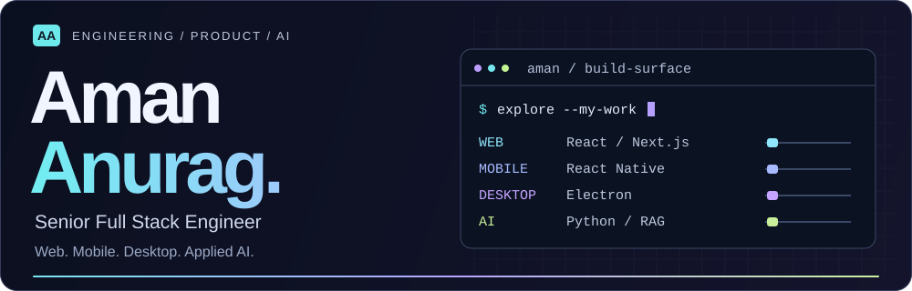
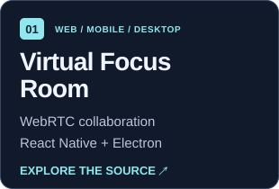
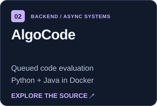
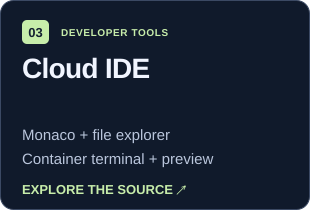

  <strong>4+ years building products from architecture to production.</strong> 
  New Delhi / Remote · Open to Senior Full Stack &amp; Applied AI Engineering roles

  
  
  
  

## Choose your experience

  
  

**[Explore the desk](https://aman-portfolio-sigma-eight.vercel.app/desk)** · **[Play Career Rush](https://aman-portfolio-sigma-eight.vercel.app/play)** · [Take the guided tour](https://aman-portfolio-sigma-eight.vercel.app/desk?tour=1) · [Animated profile](./README.md)

## What I bring to a team

**Currently:** building an AI CRM and customer engagement suite at **Skyclad Ventures**: RAG knowledge, chat, voice agents, appointments, tenant access control, and human handoff.

| Product delivery | Cross-platform engineering |
| :--- | :--- |
| **25+ backend APIs** and **20+ workflows** for Payment Center | **React Native + Electron** alongside React and Next.js |
| **30+ reusable components**, reducing repeated frontend effort by **~35%** | Accommodation systems serving **500+ daily users** |

## Open the code

  
  
  

<strong>Virtual Focus Room → demos and engineering decisions</strong>

Built a co-working workspace with video/audio, screen sharing, chat, and a shared whiteboard. Custom Socket.IO signaling coordinates the WebRTC flow; `RTCRtpSender.replaceTrack` switches screen sharing without rebuilding the peer connection.

**React · React Native / Expo · Electron · WebRTC · Socket.IO**

[Web app](https://virtual-focus-room.vercel.app/) · [Watch the original demo](https://youtu.be/wLVO5xj3O2Q) · [Mobile code](https://github.com/amananurag20/Virtual-focus-room/tree/main/focus-room-app) · [Desktop code](https://github.com/amananurag20/Virtual-focus-room/tree/main/focus-room-electronjs)

<strong>AlgoCode → queues, workers, and code execution</strong>

Built services that accept submissions, process work through BullMQ/Redis queues, execute Python and Java in Docker containers, and deliver results through Socket.IO. Request handling and evaluation workers have separate responsibilities.

**TypeScript · Node.js · Fastify · BullMQ · Redis · Docker**

[Read the backend code](https://github.com/amananurag20/Full-backend-algocode) · [Try the illustrative queue playground](https://aman-portfolio-sigma-eight.vercel.app/#systems-lab)

<strong>Cloud IDE → editor, filesystem, and terminal</strong>

Built a browser development environment with a React/Monaco editor, file explorer, Docker-backed terminal over WebSockets, and a preview pane.

**React · JavaScript · Node.js · Monaco · Docker · WebSockets**

[Explore the implementation](https://github.com/amananurag20/Project-idx-react)

## A tiny systems challenge

<strong>▶ Play “Ship the submission” · about 20 seconds</strong>

Your API receives a burst of **new code submissions**. Each evaluation takes several seconds. How would you keep execution work out of the HTTP request workers?

Choose a design to reveal the result:

A · Execute each program inside the API worker

**Try another route.** Long-running evaluation ties up the request worker and couples API capacity to execution time. Move that work behind a queue and return a submission ID.

B · Queue submissions and use separate execution workers

**Deployment unlocked.** Accept the submission, return its ID, and let workers evaluate it asynchronously. Deliver the result separately. Next decisions: backlog limits, retries, idempotency, and resource limits.

[Explore my AlgoCode implementation](https://github.com/amananurag20/Full-backend-algocode) · [Take a victory lap in Career Rush](https://aman-portfolio-sigma-eight.vercel.app/play)

C · Add a result cache and keep the same execution path

**Useful for repeated work, but this burst is new work.** A result cache alone does not separate execution from the request workers. Look for the option that changes where evaluation happens.

## My toolkit

`TypeScript` `React` `Next.js` `Python` `RAG` `React Native` `Electron` `Node.js` `PostgreSQL` `Docker`

<strong>Expand the full stack → AI, mobile, desktop, backend, cloud</strong>

| Area | Technologies and practices |
| :--- | :--- |
| **Languages** | TypeScript, JavaScript, Python |
| **Web** | React, Next.js, Redux Toolkit, Zustand, Vite, Tailwind CSS, Material UI, Radix UI, Bootstrap |
| **Mobile** | React Native, Expo, AsyncStorage, offline-first data flows |
| **Desktop** | Electron, IPC, context isolation, preload scripts, native integrations, auto-updates, code signing, macOS notarization |
| **Backend and real-time** | Node.js, Express, Fastify, REST APIs, WebRTC, Socket.IO, RabbitMQ, BullMQ |
| **AI and retrieval** | RAG pipelines, LangChain, LangGraph, OpenAI API, prompt engineering, embeddings, vector search, Pinecone, Weaviate |
| **ML foundations** | PyTorch, TensorFlow, Hugging Face, CNNs, ANNs |
| **Data** | PostgreSQL, MongoDB, Prisma, Redis |
| **Cloud and delivery** | AWS EC2 / ECS / Fargate / ECR / S3, Docker, Jenkins, CI/CD, CloudWatch, Linux |
| **Practices** | System design, API contracts, RBAC, JWT authentication, Git, GitHub, Jira, Agile/Scrum |

<strong>Experience &amp; education → the story behind the work</strong>

**Skyclad Ventures · Senior Full Stack Developer**  
February 2026–Present · Dubai, UAE / Remote

AI CRM and customer engagement delivery, plus Payment Center: 20+ payment/configuration workflows, 25+ backend APIs, and 30+ reusable React/TypeScript components. Reduced repeated frontend effort by approximately 35%.

**Klovertel · Full Stack Developer · Promoted from intern**  
January 2023–January 2026 · New Delhi, India

Built web and React Native accommodation systems serving 500+ daily users, authenticated APIs handling 50,000+ requests per day, Trace Venue’s Electron POS and offline sync, and LeadNest CRM’s table layer for 10,000+ records.

**CT University · B.Tech CSE (AI) · 2020–2024**  
Gold Medalist — highest CGPA in the School of Engineering & Technology (CSE–AI) · **8.67/10**

[Full experience and case studies](https://aman-portfolio-sigma-eight.vercel.app/#experience) · [Résumé](https://drive.google.com/file/d/1fB0E6kx9WJq0m987UU4ZXrCN5_bijFQg/view)

<strong>GitHub activity</strong>

[View my GitHub activity and repositories](https://github.com/amananurag20)

---

**Building an AI product, a real-time platform, or an app across devices?**  
[Email Aman](mailto:amananurag.20@gmail.com) · [Connect on LinkedIn](https://www.linkedin.com/in/aman-anurag-a160441b7) · [Read my résumé](https://drive.google.com/file/d/1fB0E6kx9WJq0m987UU4ZXrCN5_bijFQg/view)
