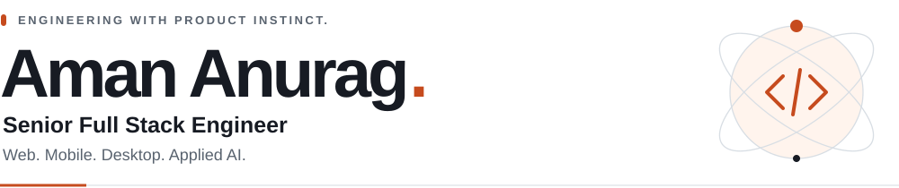
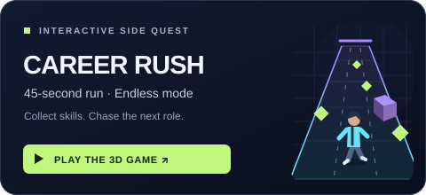
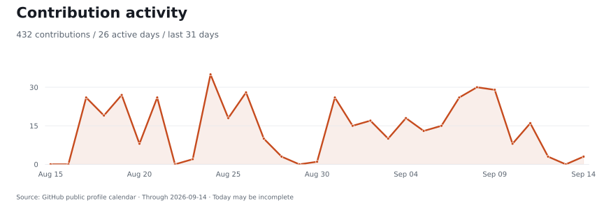

<a href="https://aman-portfolio-sigma-eight.vercel.app/">
  <picture>
    <source media="(prefers-color-scheme: dark)" srcset="./assets/profile-header-dark-static.svg" />
    
  </picture>
</a>

**4+ years taking products from architecture to production.** New Delhi / Remote.  
I build AI customer engagement systems at **Skyclad Ventures**, and ship across React, React Native, Electron, and Python. Open to Senior Full Stack and Applied AI Engineering roles.

**[Portfolio ↗](https://aman-portfolio-sigma-eight.vercel.app/)** &nbsp; / &nbsp; [Résumé](https://drive.google.com/file/d/1fB0E6kx9WJq0m987UU4ZXrCN5_bijFQg/view) &nbsp; / &nbsp; [LinkedIn](https://www.linkedin.com/in/aman-anurag-a160441b7) &nbsp; / &nbsp; [Email me](mailto:amananurag.20@gmail.com)

## Selected work

<table>
<tr>
<td width="50%" valign="top">

</td>
<td width="50%" valign="top">

</td>
</tr>
<tr>
<td width="50%" valign="top">
<h3>01 / AgentCore</h3>

<strong>AI CRM &amp; customer engagement</strong>

RAG knowledge, voice agents, chat and human handoff. Multi-tenant access control and appointment workflows.

<code>Python</code> <code>RAG</code> <code>React</code> <code>Node.js</code>

<a href="https://aman-portfolio-sigma-eight.vercel.app/#agentcore"><strong>Read the case study ↗</strong></a>

</td>
<td width="50%" valign="top">
<h3>02 / AlgoCode</h3>

<strong>Asynchronous code evaluation</strong>

Submissions flow through BullMQ/Redis queues to Python and Java execution workers in Docker. Results arrive over Socket.IO.

<code>TypeScript</code> <code>Redis</code> <code>Docker</code>

<a href="https://github.com/amananurag20/Full-backend-algocode"><strong>Explore the backend ↗</strong></a>

</td>
</tr>
</table>

**03 / [Virtual Focus Room](https://github.com/amananurag20/Virtual-focus-room)** — WebRTC co-working, screen sharing, chat, and a shared whiteboard across **React, React Native, and Electron**. [Watch demo ↗](https://youtu.be/wLVO5xj3O2Q)

**04 / [Cloud IDE](https://github.com/amananurag20/Project-idx-react)** — A browser workspace with **Monaco**, a file explorer, a **Docker terminal over WebSockets**, and live preview.

<strong>Engineering notes → architecture, implementation, and public code</strong>

<strong>Virtual Focus Room → demos and engineering decisions</strong>

Built a co-working workspace with video/audio, screen sharing, chat, and a shared whiteboard. Custom Socket.IO signaling coordinates the WebRTC flow; `RTCRtpSender.replaceTrack` switches screen sharing without rebuilding the peer connection.

**React · React Native / Expo · Electron · WebRTC · Socket.IO**

[Web app](https://virtual-focus-room.vercel.app/) · [Watch the original demo](https://youtu.be/wLVO5xj3O2Q) · [Mobile code](https://github.com/amananurag20/Virtual-focus-room/tree/main/focus-room-app) · [Desktop code](https://github.com/amananurag20/Virtual-focus-room/tree/main/focus-room-electronjs)

<strong>AlgoCode → queues, workers, and code execution</strong>

Built services that accept submissions, process work through BullMQ/Redis queues, execute Python and Java in Docker containers, and deliver results through Socket.IO. Request handling and evaluation workers have separate responsibilities.

**TypeScript · Node.js · Fastify · BullMQ · Redis · Docker**

[Read the backend code](https://github.com/amananurag20/Full-backend-algocode) · [Try the illustrative queue playground](https://aman-portfolio-sigma-eight.vercel.app/#systems-lab)

<strong>Cloud IDE → editor, filesystem, and terminal</strong>

Built a browser development environment with a React/Monaco editor, file explorer, Docker-backed terminal over WebSockets, and a preview pane.

**React · JavaScript · Node.js · Monaco · Docker · WebSockets**

[Explore the implementation](https://github.com/amananurag20/Project-idx-react)

> **Delivered in production:** 25+ backend APIs and 20+ Payment Center workflows.  
> 30+ reusable components reduced repeated frontend effort by ~35%.

## Off the README

Two things I built for you to explore. The full interactive experiences open in my portfolio.

<table>
<tr>
<td width="50%" valign="top">

<h3>The developer desk</h3>

Four devices. Click into the work, or take a 30-second guided tour.

<a href="https://aman-portfolio-sigma-eight.vercel.app/desk"><strong>Explore in 3D ↗</strong></a> · <a href="https://aman-portfolio-sigma-eight.vercel.app/desk?tour=1">Start the tour</a>

</td>
<td width="50%" valign="top">

<h3>Career Rush</h3>

A three-lane 3D runner. Try the 45-second Recruiter Run or Endless Mode.

<a href="https://aman-portfolio-sigma-eight.vercel.app/play"><strong>Play the game ↗</strong></a>

</td>
</tr>
</table>

<strong>▶ Play “Ship the submission” · about 20 seconds</strong>

Your API receives a burst of **new code submissions**. Each evaluation takes several seconds. How would you keep execution work out of the HTTP request workers?

Choose a design to reveal the result:

A · Execute each program inside the API worker

**Try another route.** Long-running evaluation ties up the request worker and couples API capacity to execution time. Move that work behind a queue and return a submission ID.

B · Queue submissions and use separate execution workers

**Deployment unlocked.** Accept the submission, return its ID, and let workers evaluate it asynchronously. Deliver the result separately. Next decisions: backlog limits, retries, idempotency, and resource limits.

[Explore my AlgoCode implementation](https://github.com/amananurag20/Full-backend-algocode) · [Take a victory lap in Career Rush](https://aman-portfolio-sigma-eight.vercel.app/play)

C · Add a result cache and keep the same execution path

**Useful for repeated work, but this burst is new work.** A result cache alone does not separate execution from the request workers. Look for the option that changes where evaluation happens.

## My toolkit

<table>
<tr>
<td width="50%" valign="top">
<h3>Web &amp; interfaces</h3>

React · Next.js · TypeScript · JavaScript Tailwind CSS · Redux Toolkit · Zustand

</td>
<td width="50%" valign="top">
<h3>Mobile &amp; desktop</h3>

React Native · Expo · Electron WebRTC · offline sync · native integrations

</td>
</tr>
<tr>
<td width="50%" valign="top">
<h3>AI &amp; data</h3>

<strong>Python · RAG · LangChain · LangGraph</strong> PyTorch · TensorFlow · PostgreSQL · MongoDB · Redis · vector search

</td>
<td width="50%" valign="top">
<h3>Backend &amp; delivery</h3>

Node.js · Express · Fastify · Docker · AWS Socket.IO · BullMQ · CI/CD · Git

</td>
</tr>
</table>

<strong>Expand the full stack → AI, mobile, desktop, backend, cloud</strong>

| Area | Technologies and practices |
| :--- | :--- |
| **Languages** | TypeScript, JavaScript, Python |
| **Web** | React, Next.js, Redux Toolkit, Zustand, Vite, Tailwind CSS, Material UI, Radix UI, Bootstrap |
| **Mobile** | React Native, Expo, AsyncStorage, offline-first data flows |
| **Desktop** | Electron, IPC, context isolation, preload scripts, native integrations, auto-updates, code signing, macOS notarization |
| **Backend and real-time** | Node.js, Express, Fastify, REST APIs, WebRTC, Socket.IO, RabbitMQ, BullMQ |
| **AI and retrieval** | RAG pipelines, LangChain, LangGraph, OpenAI API, prompt engineering, embeddings, vector search, Pinecone, Weaviate |
| **ML foundations** | PyTorch, TensorFlow, Hugging Face, CNNs, ANNs |
| **Data** | PostgreSQL, MongoDB, Prisma, Redis |
| **Cloud and delivery** | AWS EC2 / ECS / Fargate / ECR / S3, Docker, Jenkins, CI/CD, CloudWatch, Linux |
| **Practices** | System design, API contracts, RBAC, JWT authentication, Git, GitHub, Jira, Agile/Scrum |

<strong>Experience &amp; education → the story behind the work</strong>

**Skyclad Ventures · Senior Full Stack Developer**  
February 2026–Present · Dubai, UAE / Remote

AI CRM and customer engagement delivery, plus Payment Center: 20+ payment/configuration workflows, 25+ backend APIs, and 30+ reusable React/TypeScript components. Reduced repeated frontend effort by approximately 35%.

**Klovertel · Full Stack Developer · Promoted from intern**  
January 2023–January 2026 · New Delhi, India

Built web and React Native accommodation systems serving 500+ daily users, authenticated APIs handling 50,000+ requests per day, Trace Venue’s Electron POS and offline sync, and LeadNest CRM’s table layer for 10,000+ records.

**CT University · B.Tech CSE (AI) · 2020–2024**  
Gold Medalist — highest CGPA in the School of Engineering & Technology (CSE–AI) · **8.67/10**

[Full experience and case studies](https://aman-portfolio-sigma-eight.vercel.app/#experience) · [Résumé](https://drive.google.com/file/d/1fB0E6kx9WJq0m987UU4ZXrCN5_bijFQg/view)

## GitHub activity

<a href="https://github.com/amananurag20">
  <picture>
    <source media="(prefers-color-scheme: dark)" srcset="./profile/activity-dark.svg" />
    
  </picture>
</a>

<table>
<tr>
<td width="50%" valign="top"></td>
<td width="50%" valign="top"></td>
</tr>
</table>

Refreshed daily. Contribution counts follow GitHub's public calendar; language percentages describe repository code, not skill levels.

### GitHub trophies

  

Community-generated activity milestones, alongside the projects and professional experience above.

<strong>GitHub contribution history</strong>

[View my GitHub contribution history](https://github.com/amananurag20)

---

**Let's build something people use.**  
[Email Aman](mailto:amananurag.20@gmail.com) · [Connect on LinkedIn](https://www.linkedin.com/in/aman-anurag-a160441b7) · [Animated version](./README.md)
