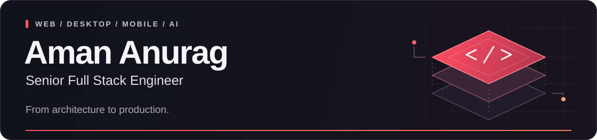

  

  <strong>Senior Full Stack Engineer</strong> 
  4+ years building products across fintech, SaaS, CRM, and real-time platforms. 
  New Delhi, India · Working remotely · Open to Senior Full Stack and Applied AI Engineering roles

  <a href="https://aman-portfolio-sigma-eight.vercel.app/"><strong>Explore my portfolio ↗</strong></a>
  &nbsp; · &nbsp;
  <a href="https://www.linkedin.com/in/aman-anurag-a160441b7">LinkedIn</a>
  &nbsp; · &nbsp;
  <a href="mailto:amananurag.20@gmail.com">Email</a>
  &nbsp; · &nbsp;
  <a href="https://drive.google.com/file/d/1fB0E6kx9WJq0m987UU4ZXrCN5_bijFQg/view">Résumé</a>

---

## What I build

I take products from architecture through production: APIs, interfaces, AI integrations, deployment, and release delivery. My work spans **React and Next.js applications, React Native mobile apps, Electron desktop software, and Python-based AI workflows**.

- **AI and customer engagement:** RAG knowledge assistants, voice agents, embeddable chat, WhatsApp automation, and human handoff.
- **Real-time systems:** WebRTC media, Socket.IO messaging, live operations, and asynchronous job processing.
- **Desktop and mobile:** Offline-first experiences, local data sync, Electron IPC, native integrations, and app distribution.

## Production work

### Skyclad Ventures · Senior Full Stack Developer
*February 2026 – Present · Dubai, UAE / Remote*

**AI CRM and customer engagement:** Currently architecting and delivering a multi-tenant suite with RAG-based knowledge, customer chat, voice agents, appointment booking, lead management, access control, and real-time agent handoff.

**Payment Center:** Led delivery across **20+ payment and configuration workflows**, designed and integrated **25+ backend APIs**, and built **30+ reusable React/TypeScript components**, reducing repeated frontend development effort by approximately **35%**.

### Klovertel · Full Stack Developer
*January 2023 – January 2026 · New Delhi, India · Promoted from intern*

- Built a MERN accommodation platform and React Native app serving **500+ daily users**; implemented authenticated APIs handling **50,000+ requests per day**.
- Built **Trace Venue**, an Electron POS application with thermal printing and offline-first local database sync.
- Engineered **LeadNest CRM**, including lead pipelines, role-based access, and a table layer handling **10,000+ records** with search and exports.

## Selected public projects

### 01 · Virtual Focus Room
**Real-time collaboration across web, desktop, and mobile.**

A co-working workspace with WebRTC video/audio, screen sharing, chat, and a shared whiteboard. Built a custom Socket.IO signaling flow and used `RTCRtpSender.replaceTrack` to switch screen sharing without rebuilding the peer connection.

`React` `React Native / Expo` `Electron` `WebRTC` `Socket.IO`

[Source code](https://github.com/amananurag20/Virtual-focus-room) · [Web app](https://virtual-focus-room.vercel.app/) · [Video demo](https://youtu.be/wLVO5xj3O2Q)

### 02 · AlgoCode
**Queued code evaluation with container-based execution.**

Backend services that process submissions through BullMQ/Redis queues, execute Python and Java programs in Docker containers, and deliver results through Socket.IO. Separates request handling from evaluation workers.

`TypeScript` `Node.js` `Fastify` `BullMQ` `Redis` `Docker`

[Source code](https://github.com/amananurag20/Full-backend-algocode)

### 03 · Cloud IDE / Project IDX Clone
**A browser-based development environment.**

A React/Monaco editor with a file explorer, Docker-backed terminal over WebSockets, and a preview pane. Connects file operations and terminal sessions to the development workspace.

`React` `JavaScript` `Node.js` `Monaco Editor` `Docker` `WebSockets`

[Source code](https://github.com/amananurag20/Project-idx-react)

## Technical toolkit

| Area | Technologies and practices |
| :--- | :--- |
| **Languages** | TypeScript, JavaScript, Python |
| **Web** | React, Next.js, Redux Toolkit, Zustand, Vite, Tailwind CSS, Material UI, Radix UI, Bootstrap |
| **Mobile** | React Native, Expo, AsyncStorage, offline-first data flows |
| **Desktop** | Electron, IPC, context isolation, preload scripts, native integrations, auto-updates, code signing, macOS notarization |
| **Backend and real-time** | Node.js, Express, Fastify, REST APIs, WebRTC, Socket.IO, RabbitMQ, BullMQ |
| **AI and retrieval** | RAG pipelines, LangChain, LangGraph, OpenAI API, prompt engineering, embeddings, vector search, Pinecone, Weaviate |
| **ML foundations** | PyTorch, TensorFlow, Hugging Face, CNNs, ANNs |
| **Data** | PostgreSQL, MongoDB, Prisma, Redis |
| **Cloud and delivery** | AWS EC2 / ECS / Fargate / ECR / S3, Docker, Jenkins, CI/CD, CloudWatch, Linux |
| **Engineering practices** | System design, API contracts, RBAC, JWT authentication, Git, GitHub, Jira, Agile/Scrum |

## Education

**B.Tech in Computer Science Engineering (AI)** · CT University · 2020–2024  
**Gold Medalist** — highest CGPA in the School of Engineering & Technology (CSE–AI) · **8.67/10**

<strong>GitHub activity</strong>

 

  
  

---

### Let's build something useful

Looking for an engineer who can own the API, product experience, AI integration, and release? I'd be happy to discuss your team and the problems you're solving.

**[Email me](mailto:amananurag.20@gmail.com)** · [Connect on LinkedIn](https://www.linkedin.com/in/aman-anurag-a160441b7) · [Explore my work](https://aman-portfolio-sigma-eight.vercel.app/) · [View résumé](https://drive.google.com/file/d/1fB0E6kx9WJq0m987UU4ZXrCN5_bijFQg/view)
