### Aman Anurag

**Senior Full Stack Engineer** · New Delhi, India

Building AI-powered CRM & customer engagement systems — RAG assistants, voice agents, WhatsApp automation, real-time agent handoff.

---

## About

I build full products end to end — architecture, APIs, frontend, AI integrations, DevOps, and release delivery — across **fintech, SaaS, CRM, and real-time platforms**.

* 🏗️ Currently at **Skyclad Ventures** (Dubai, remote), leading a **Payment Center** platform: 20+ payment/config workflows, 25+ backend APIs, RBAC and audit flows
* 🤖 Shipping **GenAI features in production**: RAG pipelines, LangChain/LangGraph agents, vector search, embeddable chat, voice agents
* 🖥️ One of the few web devs who also ships **desktop** — Electron with IPC, offline-first sync, thermal POS printing, code signing & notarization
* 🎓 **Gold Medalist**, B.Tech CSE (AI) — highest CGPA in School of Engineering, CT University (8.67/10)
* 💬 Happy to talk about **WebRTC, real-time systems, RAG architecture, and Electron distribution**

---

## Featured Projects

| Project                      | What it does                                                                                                                                                                                                                                                                        | Stack                                                | Links                                                                                                                                                                                                                                                                                                                      |
| ---------------------------- | ----------------------------------------------------------------------------------------------------------------------------------------------------------------------------------------------------------------------------------------------------------------------------------- | ---------------------------------------------------- | -------------------------------------------------------------------------------------------------------------------------------------------------------------------------------------------------------------------------------------------------------------------------------------------------------------------------- |
| **Virtual Focus Room**       | Real-time virtual co-working — P2P video/audio, screen share, collaborative whiteboard, tiered permissions. Custom Socket.io signaling server with full offer/answer/ICE flow; `replaceTrack` for screen-share toggling without renegotiation. Ships on **web + desktop + mobile**. | React · Electron · React Native · WebRTC · Socket.io | [Live](https://virtual-focus-room.vercel.app/) · [Demo](https://youtu.be/wLVO5xj3O2Q) · [EXE](https://drive.google.com/file/d/1VikEzkPoHQCH57ufVbFS-e6TiUEfu5dm/) · [APK](https://drive.google.com/file/d/1NU1deKB9WOIFkBb-Tf0cWUV2VU47gSah/view?usp=sharing) · [Code](https://github.com/amananurag20/Virtual-focus-room) |
| **Course Management System** | Full LMS: video tutorials with progress tracking, MCQ quiz engine, coding problems in Monaco Editor executed in **sandboxed Docker containers**, Razorpay/Stripe payments, admin analytics.                                                                                         | React · Node · MongoDB · Electron · Docker           | [Live](https://course-management-opal.vercel.app/) · [Demo](https://youtu.be/W2NJIZ1l7sQ) · [EXE](https://drive.google.com/file/d/1cUpARfK41Ge6P2RM9iUqKGPp5znIk_Yi/view?usp=sharing) · [Code](https://github.com/amananurag20/course-management)                                                                          |
| **Code Execution Platform**  | LeetCode-style microservices platform. Executor service runs Java/Python/C++ in Docker using Strategy + Factory patterns; Fastify submission service with Redis queues and WebSocket feedback. Auto-scaling on AWS.                                                                 | TypeScript · Fastify · Redis · Docker · AWS          | [Code](#)                                                                                                                                                                                                                                                                                                                  |
| **Project IDX Clone**        | Cloud IDE that provisions an isolated Linux container per project via Dockerode. In-browser terminal (xterm.js over WebSockets) and live file explorer synced with Chokidar.                                                                                                        | React · TS · Node · Docker · Zustand                 | [Code](#)                                                                                                                                                                                                                                                                                                                  |

---

## Tech Stack

**Languages**  

**Frontend**  

**Backend & Real-time**  

**AI / GenAI**  

**Data**  

**Desktop & DevOps**  

---

## Impact by the Numbers

<table>
<tr>
<td align="center"><strong>50,000+</strong> API requests handled daily</td>
<td align="center"><strong>500+</strong> daily users on booking platform</td>
<td align="center"><strong>10,000+</strong> records in CRM table layer</td>
<td align="center"><strong>99.9%</strong> production uptime</td>
</tr>
<tr>
<td align="center"><strong>~40%</strong> fewer integration defects</td>
<td align="center"><strong>~35%</strong> less repeat frontend work</td>
<td align="center"><strong>~60%</strong> fewer API calls via debouncing</td>
<td align="center"><strong>3</strong> platforms shipped per product</td>
</tr>
</table>

---

## Experience

**Senior Full Stack Developer** — Skyclad Ventures, Dubai (Remote) · *Feb 2026 – Present*

Payment Center platform. 20+ payment/config workflows, 25+ APIs across auth, RBAC, payer data and audit flows, 30+ reusable React/TS components.

**Full Stack Developer** — Klovertel, New Delhi · *Jan 2023 – Jan 2026* *(promoted from intern)*

MERN accommodation platform with React Native app · GPS fleet dispatch with geospatial queries · Trace Venue Electron POS app · LeadNest CRM · Twilio Voice, WhatsApp API, SignalR, Sentry.

**B.Tech CSE (AI)** — CT University · *2020 – 2024* · CGPA 8.67 · 🥇 Gold Medalist

---

## Engineering Notes

Short write-ups on things I've built and debugged:

* **Toggling screen share in WebRTC without renegotiation** — why `RTCRtpSender.replaceTrack` beats tearing down the peer connection
* **Offline-first Electron**: local DB, sync queues, and reaching 99% uptime with no internet
* **Running untrusted code safely** — Docker sandbox design in the executor service
* **RAG in production**: chunking, retrieval quality, and when the vector DB isn't the problem

> Optional but very high signal. Even 3 posts on Dev.to / Hashnode / your portfolio makes you memorable in interviews.

---

### Contribution Activity

### Contribution Snake

### Trophies

 

---

### Let's talk

I'm open to **Senior Full Stack** and **AI Engineer** roles, and to collaborating on real-time or GenAI side projects.

⭐ If any of my projects helped you, a star means a lot.

